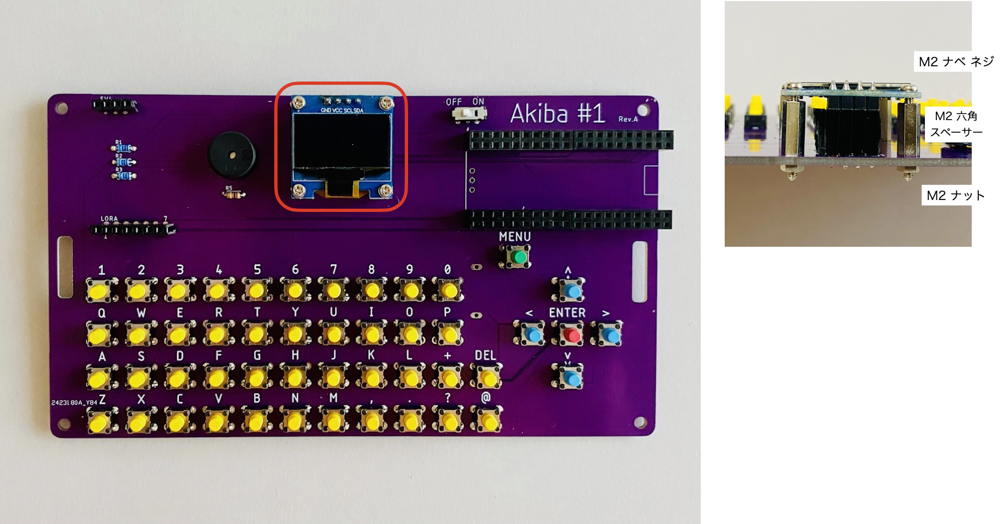
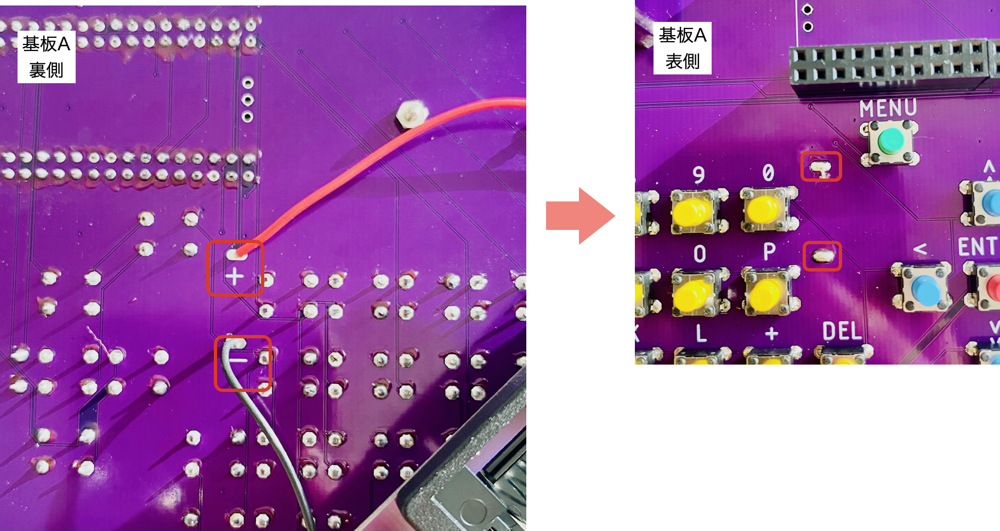

# 組立手順

## 1.基板Aにタクトスイッチをはめる。

## 2.はめたタクトスイッチを裏面にし、はんだ付けをしていく。
 ポイント：タクトスイッチがズレていないか確認しつつはんだ付けをしていく。 ポイント：はんだは穴に流し込むように付ける。

## 3.青色の抵抗(金属皮膜抵抗)とベージュ色の抵抗(カーボン抵抗)をはんだ付けをし、余分な箇所はペンチで切る。
 ポイント：はんだ付けをしながら抵抗の金属部分に触れると熱いので注意すること。

## 4.圧電スピーカー、スライドスイッチ、ピンソケットをはんだ付けする。

## 5.分割ロングピンソケットを穴にあわせて切りはんだ付けする。
 ポイント：分割ロングピンソケットを切る際は、中身の金具部分が誤って見えてしまわないよう注意しながら切る。

## 6.ディスプレイをネジで固定する。
 ポイント：4箇所の角をネジ・ディスプレイ・スペーサーで合わせ、ナットで固定するとスムーズです。

## 7.Ｒａｓｐｂｅｒｒｙ Ｐｉ Ｐｉｃｏをつける。　

## 8.基板Bに電池ボックスをはめ込みネジで固定する。

## ９.赤色・黒色線の両端のビニル部分をニッパーで3mmほどはがす。赤色の線は＋(プラス)へ、黒色の線は−(マイナス)へ電池ボックスへはめ、はんだ付けする。

## 10.赤色・黒色の線の片一方は、基板Aの裏側の穴へ入れ(赤色の線は＋へ、黒色の線は−へ)、表側からはんだ付けする。

## 11.基板Aと基板Bを合わせ角の４箇所をネジで固定する。

## 12.ＬｏＲａモジュールの穴の数にあわせてピンヘッダを切る。本体にピンヘッダ、ＬｏＲａモジュールを差し込みはんだ付けする。

## 13.最後にＬｏＲａ用アンテナをつけ完成。

