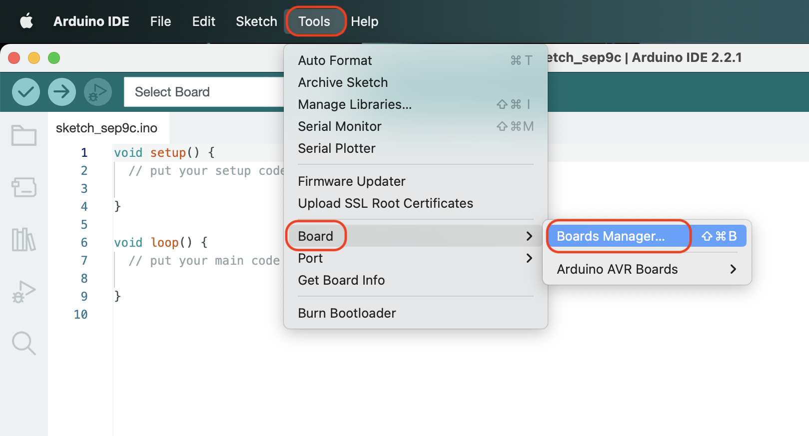
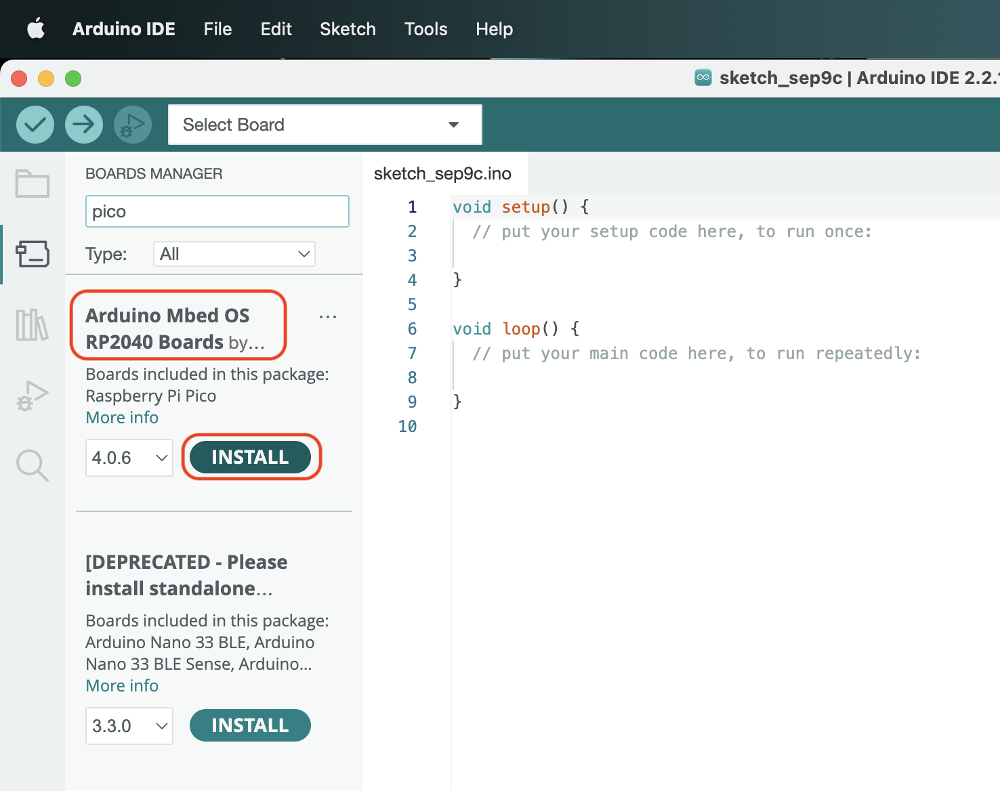
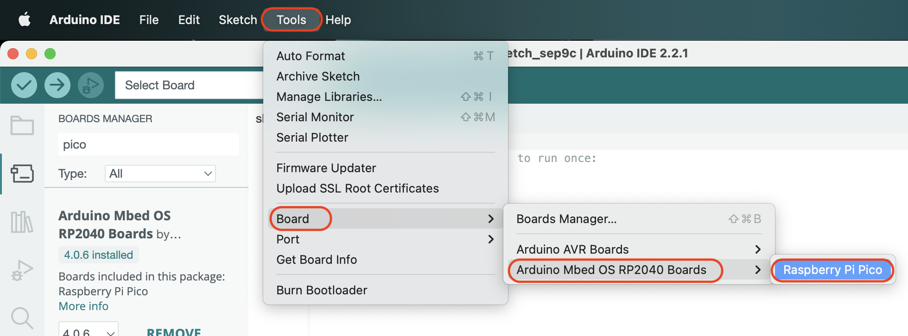

# 開発環境の構築

## LoRa Communicatorの開発環境

LoRa Communicatorは、Arduino IDEでおこないます。

[Arduinoのページ](https://www.arduino.cc/en/software)よりArduio IDE(バージョン2.x)をダウンロードしてください。

## Arduino IDEの設定

Arduino IDEでのRaspberryPi Pico向けの開発は、Arduino Mbed OS RP2040 Boardsを使用します。
Arduino IDEのメニューから、`[Tools]-[Board]-[Boards Manager...]`を選択します。

左に出てくるメニューで、Arduino Mbed OS RP2040 Boardsの`[Install]`を選択します。

Arduino IDEのメニューから、`[Tools]-[Board]-[Arduino Mbed OS RP2040]-[RaspberryPi Pico`が表示されます。

これで準備完了です。

